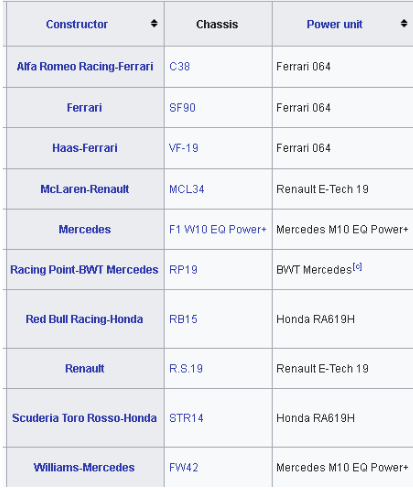

### Ejercicio 10. JDBC y SQLite
Se ha creado una base de datos SQLite con los datos de la temporada 2019 de Formula 1. Analiza el código y
realiza las siguientes 3 consultas:
***
1. Clasificación final ordenada del mundial de pilotos
2. Pilotos con 30 años o más (a día de hoy), ordenados de mayor a menor edad.
3. Como en la consulta anterior, pero permite que sea el usuario el que especifique el límite de edad
   mínima de los pilotos a mostrar.
***
Vas ahora a añadir una nueva tabla Teams y añadirle sus registros correspondientes. Para ello, fíjate en la
columna team de la tabla Drivers para que el contenido sea el mismo que el que aparece en la primera
columna Constructor de la siguiente imagen de la Wikipedia (y así no tener problemas de claves ajenas).

Como puedes ver, el código en la función main se hace insostenible por lo que es una buena práctica crear
una clase que controle la gestión de la base de datos.
¿Podrías refactorizar segmentos de códigos que aparecen en ella en funciones propias de la gestión de la base de datos?